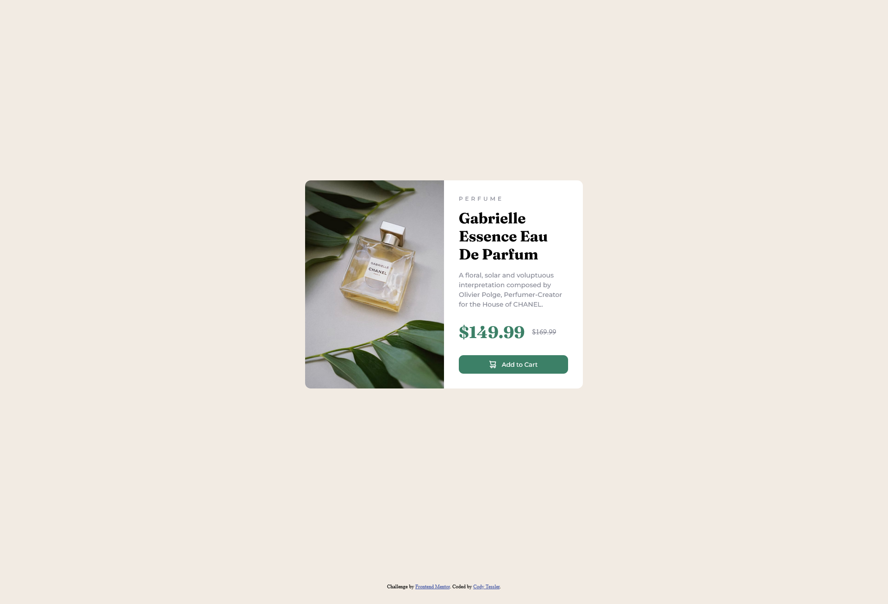

# Frontend Mentor - Product preview card component solution

This is a solution to the [Product preview card component challenge on Frontend Mentor](https://www.frontendmentor.io/challenges/product-preview-card-component-GO7UmttRfa). Frontend Mentor challenges help you improve your coding skills by building realistic projects. 

## Table of contents

- [Overview](#overview)
  - [The challenge](#the-challenge)
  - [Screenshot](#screenshot)
- [My process](#my-process)
  - [Built with](#built-with)
  - [What I learned](#what-i-learned)
  - [Continued development](#continued-development)

## Overview

### The challenge

Users should be able to:

- View the optimal layout depending on their device's screen size
- See hover and focus states for interactive elements

### Screenshot



## My process

### Built with

- Semantic HTML5 markup
- Flexbox

### What I learned

- Basic Media queries
- How to import fonts
- Place `overflow: hidden` on parent to round corners of image
- Changing images with media queries

```html
<picture>
  <source
    media="(min-width:600px)"
    srcset="/images/image-product-desktop.jpg"
  />
  <source srcset="/images/image-product-mobile.jpg" />
  
</picture>
```
